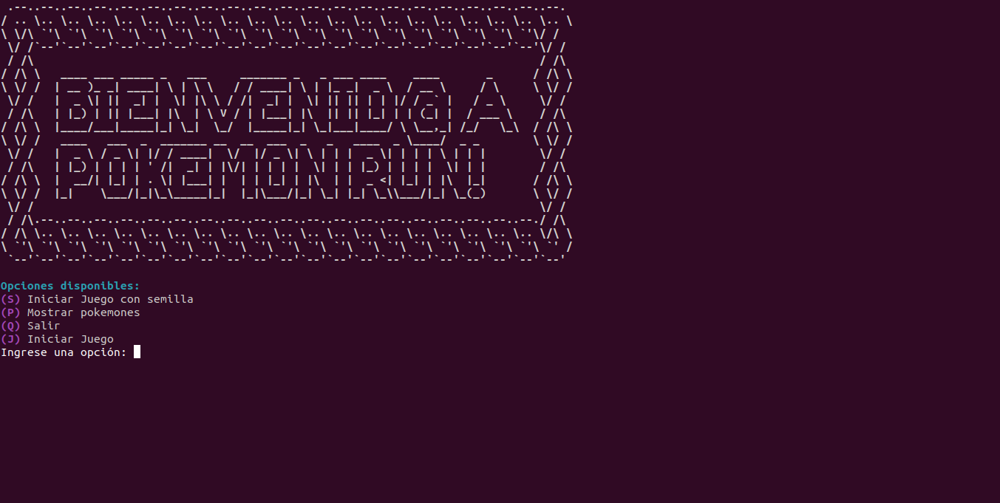
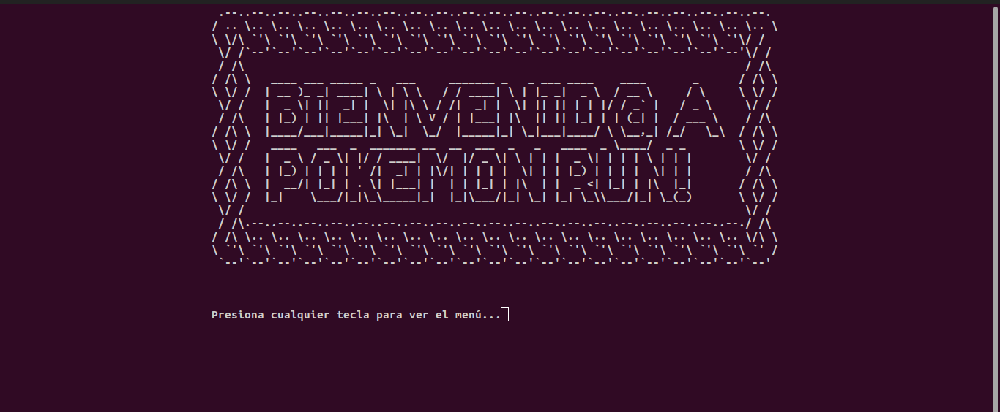
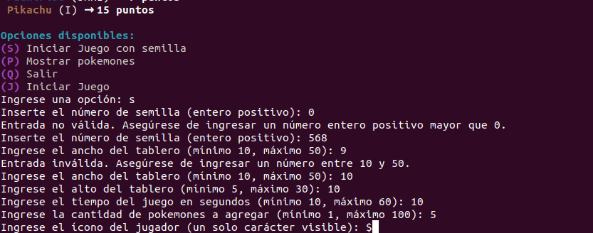
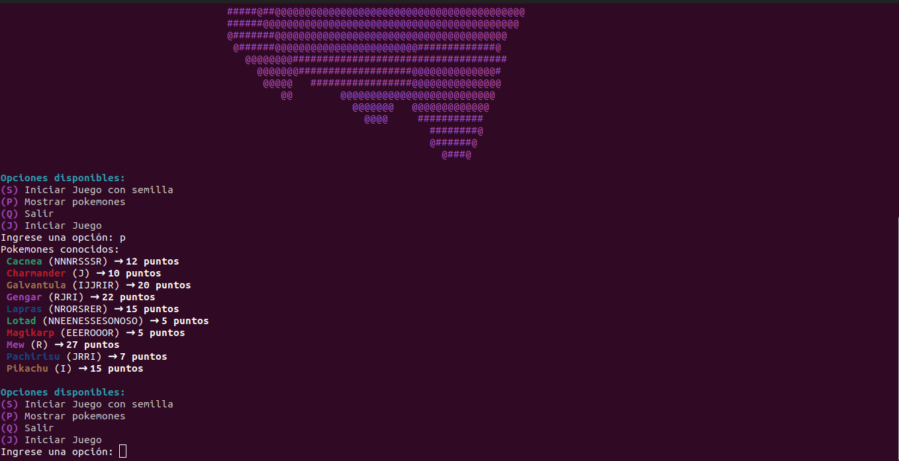
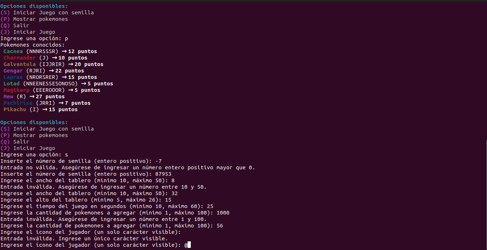
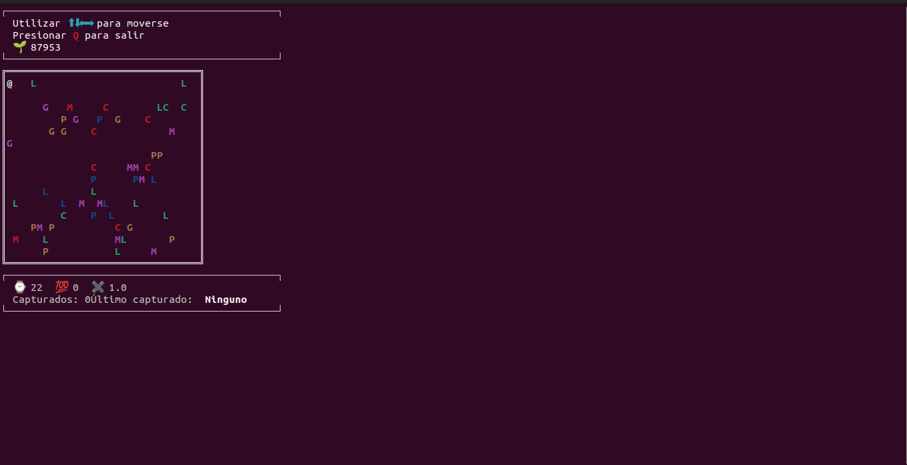
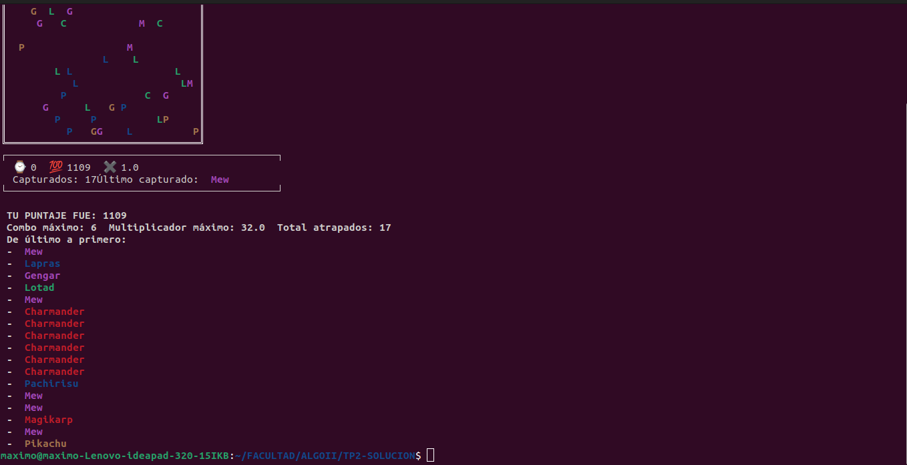
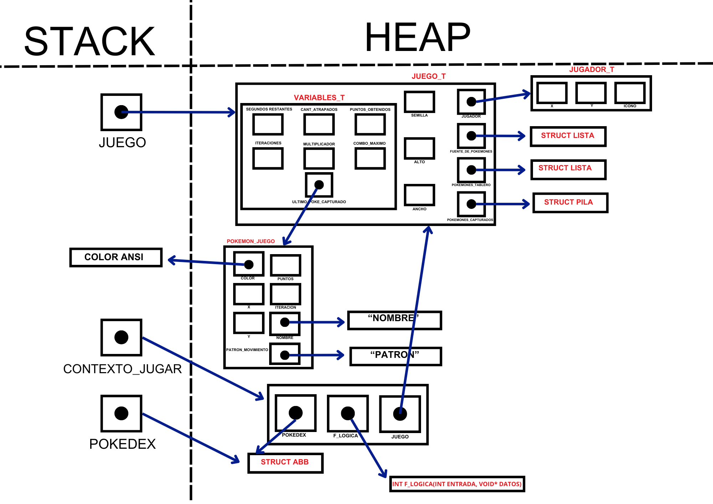
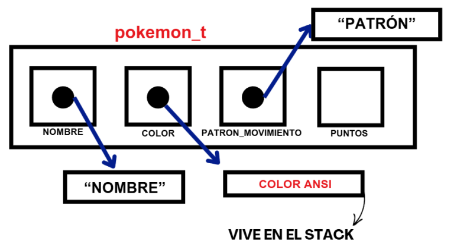
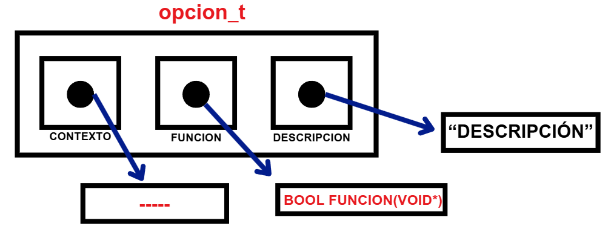

<div align="right">

</div>

# TP 2

## Repositorio de Máximo Augusto Calderón Vasil - 111810 - mcalderonv@fi.uba.ar

- Para compilar:


```bash
gcc -Wall -Werror -O2 -g -c extra/engine.c -o engine.o
gcc -std=c99 -Wall -Wconversion -Wtype-limits -pedantic -Werror -O2 -g src/*.c tp2.c engine.o -o tp2
```

- Para ejecutar:

```bash
./tp2 datos/pokedex.csv
```

- Para ejecutar con valgrind:
```bash
valgrind --leak-check=full --track-origins=yes --show-reachable=yes --error-exitcode=2 --show-leak-kinds=all --trace-children=yes ./tp2 datos/pokedex.csv
```

---
## Flujo del programa
<div align="center">

</div>
<div align="center">

</div>
<div align="center">

</div>
<div align="center">

</div>
<div align="center">

</div>
<div align="center">

</div>
<div align="center">

</div>

##  Funcionamiento

El programa tp2 funciona de la siguiente manera:
Primero se verifica que se haya pasado un archivo csv válido por parámetro. Luego, se instancia un puntero al struct archivo_csv, pasandole la ruta del archivo y el separador ',' esperado a la función, abrir_archivo_csv(). La misma se encarga de abrir el archivo de dicha ruta para su lectura. Si lo anterior se produce sin errores, se crea una **pokedex**. Esta pokedex, como mencionaré proximamente, esta implementada como un ABB. Por cada linea leida, se "parsea" el pokemon y se lo agrega a la misma.

Detrás de este proceso de *inserción*, se implementan funciones que reservan memoria de manera tal que:

* Se crea un pokemon con los atributos correspondientes (se reserva memoria ademas para su char* nombre, char* color y char* patron_movimiento). La memoria para dicho pokemon y para dichos atributos se reserva en ambos casos mediante un malloc. En el caso del color, se utiliza una funcion para obtener, dado un nombre (AZUL, ROJO, etc), el color ANSI asociado. Luego, se libera dicho color.

Una vez cargados los pokemones en la pokedex, se cierra el archivo, liberando toda la memoria reservada para el mismo. Luego, se imprime un mensaje de bienvenida que confeccioné con ansii art, y se crean un menú, confeccionado a partir de un hash, y un tda juego. En cualquiera de los casos, de haber un error se libera la memoria previamente reservada. 

El menú inicialmente se crea vacío, mientras que el juego se inicializa con valores válidos aunque pequeños, para luego, cuando el usuario quiera jugar, solicitarle sus preferencias y reemplazarlos por esos valores. Dichos valores son: ancho(10-50), alto(5-30), segundos de juego(10-60) e ícono del jugador(caracter), que otorgan un nivel de personalización mayor. Además, se le da a elegir al usuario con cuantos pokemones desea jugar la partida (entre 1-100).

Luego, se agregan las opciones necesarias al menú, que son las siguientes:

    (S) Iniciar Juego con semilla
    (P) Mostrar pokemones
    (Q) Salir
    (J) Iniciar Juego

Cabe destacar que cada opción agregada al menú, cuenta con un identificador que será la tecla que se oprima para ejecutar la misma; una descripción; una función y un contexto que se le pasa por parámetro a dicha función. El contexto y la función son opcionales. Esto quiere decir que si la función es NULL, al ejecutarse se devuelve false. De otro modo, se devuelve el retorno de la función a ejecutarse. Además, el contexto para la opción 'P', es la pokedex creada previamente; mientras que para las opciones 'J' y 'S' es una instancia de contexto_jugar_t, que detallaré más adelante. La opción 'Q' no tiene función asociada.

Una vez mostradas las opciones, se le solicitará al usuario que ingrese una opcion correcta. Las minúsculas como mayúsculas se tomarán de igual modo para este programa, lo que no significa que el TDA menú distinga entre mayúsculas y minúsculas.

Si el usuario elige la opcion Q, se ejecutara dicha accion del menú, que libera y cierra el programa. Si, al contrario, el usuario ingresa la opcion P, se mostrarán los pokemones dentro de la pokedex y se volverá a mostrar el menú. Por ultimo, al jugar, con o sin semilla, se entrará al juego y luego se finalizará el programa. Cabe mencionar que si el usuario selecciona la opcion "S", se le solicitará que ingrese un numero positivo, mayor a cero, para usar de semilla.

Volviendo al flujo del programa, una vez ejecutar_opcion() devuelva false, se libera toda la memoria utilizada (menu, contexto_jugar, pokedex, juego), y se vuelve a hacer visible el cursor con mostrar_cursor().

Gráficos de cómo se maneja la memoria en el flujo general del programa:

<div align="center">

</div>

*Memoria de un pokemon_t que se aloja en la pokedex*. Representa un nodo de un abb
<div align="center">

</div>

*Memoria de una opcion_t que se aloja en el menu*. Representa un nodo de un hash
<div align="center">

</div>

Por último me gustaría aclarar que, cuento con archivos texto_ascii que se encargan de imprimir piezas de arte de texto ascii, aislandolas ya que ocupan bastante lugar, así como también con archivos utils, que elegí para alojar funciones auxiliares que se usan en más de un archivo en simultáneo pero que no están definidas en sus respectivos .h. Estas son, copiar(), que dado un string devuelve una copia en memoria dinámica del mismo; y destruir_pokemon(), que reutilicé tanto para destruir pokemones del archivo juego.c como del archivo pokedex.c. A pesar de que sus estructuras son ligeramente distintas, ambos comparten el nombre de los punteros que utilizan a direcciones de memoria en el heap, con lo cual es válida su reutilización. 
Otra reutilización que hice fue con la función agregar_pokemon_a_lista(), que debía recibir dos punteros void y devolver un bool para poder ser utilizada por la pokedex, ya que ella se la pasa a la función de abb_iterar_inorden(). Dicha función la usé para pasar los pokemones de la pokedex a una lista, y además para pasar los pokemones de la lista fuente_de_pokemones a la lista pokemones_tablero. Y para esta última tuve que forzar el casteo a puntero void de ambos parámetros (lista y pokemon), para que cumpla con lo solicitado por la función. Esta reutilización me evita tener que crear dos funciones que hacen esencialmente lo mismo.

##  Explicación de los TDA utilizados
Para la realización de este programa se utilizaron una serie de TDA, algunos de los cuales fueron implementados previamente, mientras que otros, exclusivamente para este trabajo. 

-TDA implementados previamente: lista, pila, abb, hash.
-TDA implementados para este trabajo: pokedex, menu, juego

¿Cómo y dónde se utiliza cada TDA?

- Lista: El TDA lista se utiliza en dos partes, ambas dentro del TDA juego y ambas dentro del struct juego_t. Este struct es el que contiene todos los datos relacionados al juego. Las listas en concreto son: fuente_de_pokemones y pokemones_tablero. El struct tiene un puntero a cada una.

La primera, almacena todos los pokemones de la pokedex. La consideré necesaria, a pesar de tener la pokedex, ya que esta última es un abb, dificultando enormemente acceder a un elemento (pokemon) random del mismo para agregarlo al tablero; mientras que con la lista basta con generar un índice random válido y acceder a dicha posición. La lista se utiliza en juego_crear() y juego_destruir(), donde se crea y se destruye; agregar_pokemones(), donde se generan posiciones random según la cantidad de pokemones que se solicita agregar, se obtienen los pokemones en dicha posición y se llama a la función auxiliar agregar_pokemon_a_lista() que termina dicha acción; y en juego_subir_pokemones(), donde se cargan los pokemones existentes en una pokedex a la lista en cuestión.

Por otro lado, la lista pokemones_tablero almacena los pokemones actuales del tablero, que siempre serán la misma cantidad ya que a medida que se atrapen, se quitan de la lista y se agregan otros, cumpliendo con la cant_pokemones_tablero de juego_t. La consideré adecuada por sobre otras estructuras ya que es de fácil acceso a todas sus posiciones a través del índice. La lista se utiliza en juego_crear() y juego_destruir(), donde se crea y se destruye; en juego_agregar_pokemones(), donde se agregan los pokemones de la lista anterior a esta; en mover_pokemones(), que obtiene los pokemones de dicha lista y actualiza sus posiciones x e y; en procesar_captura_pokemon(), función auxiliar que quita el elemento de la lista, entre otras cosas; en capturar_pokemon(), que es la función que llama a la mencionada anteriormente, y se encarga de verificar de entre todos los elementos de la lista si alguno fue capturado; y lógicamente en juego_dibujar_tablero(), donde se agregan los pokemones de la lista en cuestión a una matriz tablero auxiliar para luego imprimirla. 

- Pila: El TDA pila se utiliza una vez en este programa, dentro de TDA juego. Igualmente que con las listas, el struct juego_t tiene un puntero a una pila, pokemones_capturados, que como su nombre lo indica, almacena los pokemones capturados. La consideré una buena opción para utilizar, ya que al final del juego, muestro por pantalla, uno debajo del otro, todos los pokemones capturados del último al primero. Esto lo pensé así ya que el jugador cuando termina el programa quiere saber si logró capturar o no al último pokemón que estuvo persiguiendo, y de este modo lo puede encontrar rápidamente, en vez de tener que ir a buscarlo al final de la lista de capturados. Esto es así porque la pila tiene una política LIFO, en la que el último en apilarse es el primero en desapilarse, que es lo que hago cuando imprimo. También, podría haber utilizado una lista e imprimir desde el primer elemento hasta el último, pero considero más fácil visualmente desapilar e imprimir elemento por elemento de la pila, que al fin y al cabo está implementada sobre una lista. La pila, lógicamente se utiliza en juego_crear() y juego_destruir(); en procesar_captura_pokemon(), donde se apila el pokemon quitado de pokemones_tablero(); y en juego_mostrar_estadisticas(), que es donde se hace lo comentado. 

- Los TDA abb y hash se reutilizan únicamente en los nuevos TDA pokedex y menu respectivamente. El abb almacena los pokemones de la pokedex, ya que facilita la impresión, en orden alfabético de los nombres, de los pokemones, al iterar inorden el mismo. Esto es así ya que primeramente se insertan los pokemones con una función comparadora que compara lexicográficamente dichos nombres, y los ordena en el árbol. La acción de impresión de los pokemones conforma una de las opciones existentes del menú. Dicho menú fue confeccionado sobre la base de un hash, ya que no puede tener opciones asociadas a un mismo identificador (tecla que se oprime para ejecutar la acción asociada a la opción), o de otra forma no habría un criterio claro sobre qué acción se estaría ejecutando. Para simplificar esto, decidí optar por un menú, cuyas claves son los identificadores de las opciones. Esto conserva las ventajas propias de una tabla de hash, como su fácil y poco costoso acceso a los valores del mismo. De haber un identificador ya en uso, se reemplazan los demás campos de la opción (descripción, acción y contexto).

- Pokedex: El TDA pokedex se utiliza para almacenar pokemones. Como mencioné, está armado sobre la base de un abb, ya que esto facilita la impresión de sus miembros en orden alfabético, dado su orden de inserción que compara lexicográficamente sus nombres a la hora de insertarlos. Cuenta con las siguientes primitivas: pokedex_crear(), pokedex_destruir(), pokedex_insertar(), pokedex_obtener(), pokedex_cantidad(), y pokedex_iterar() que únicamente llaman a sus funciones análogas de abb. pokedex_destruir() llama a abb_destruir_todo con una función destructora de los pokemones que se almacenan, que ya está presente en el archivo pokedex.c. Además, tiene primitivas un poco más desarrolladas, pokedex_insertar_desde_archivo() que recibe un puntero a un struct archivo_csv y otro a la pokedex, y se encarga de leer linea por linea, parsear los pokemones, obtener su color ansi e insertarlos en la pokedex; y pokedex_imprimir(), que llama a la función de iteración inorden del abb con una función de impresión por parámetro. Cabe destacar que se espera que el archivo pasado por parámetro para insertar tengo los siguientes campos:
```c
typedef struct pokemon {
	char *nombre;
	size_t puntos;
	char *color;
	char *patron_movimiento;
} pokemon_t;
```

- Menú: El TDA menu se utiliza para almacenar struct opcion. Como mencioné anteriormente, me pareció adecuada su implementación como hash ya que los identificadores deben ser únicos, al igual que las claves de un hash. Cuenta con las siguientes primitivas que reutiliza exclusivamente las funciones de hash: menu_crear(), menu_cantidad(), menu_contiene() y menu_destruir(), que llama a menu_destruir_todo() con la funcion destructora de opcion_t. Por otro lado tiene primitivas propias o que realizan otras cosas más que llamar puramente a las funciones de hash, menu_agregar_opcion() que agrega una opcion a partir de los campos recibidos, previamente instanciando una opcion_t y asignandole dichos campos
```c
typedef struct opcion {
	char *descripcion;
	bool (*funcion)(void *);
	void *contexto;
} opcion_t;
```
menu_mostrar(), que llama a la función de iteración del hash con una función de impresión para un struct opcion; y menu_ejecutar_opcion(), que ejecuta la función del struct opcion solicitado, pasándole por parámetro el contexto también presente en dicho struct, retornando el booleano de la función en cuestión, o false si directamente no tiene función asociada o en caso de error.

- Juego: El TDA juego se utiliza para manejar toda la lógica del juego consistente en atrapar pokemones mediante las teclas de flechas del teclado. Lo consideré necesario para aislar toda la lógica del juego y poder abstraer su comportamiento del archivo de flujo principal. Tiene las siguientes primitivas: juego_crear() y juego_destruir(), que crean y destruyen un juego, manejando su memoria dinámicamente; juego_subir_pokemones(), que sube los pokemones al ámbito de juego_t y define la cantidad de pokemones que se quiere tener en el juego, la cual nunca cambia por más de que se atrapen pokemones; juego_mover(), que realiza un movimiento del juego (jugador, pokemones y captura); juego_dibujar_tablero(), que muestra por pantalla el estado actual del juego; y juego_mostrar estadisticas(), que muestra las estadísticas actuales, combo máximo alcanzado, multiplicador máximo, puntaje obtenido y la lista de pokemones atrapados, que una vez mostrada se pierde, por lo que se recomienda su uso al final del juego. Cuenta con los siguientes struct: 
juego_t, que a su vez cuenta con un struct variables:
    ```c
    typedef struct variables {
	    size_t segundos_restantes;
	    size_t cant_atrapados;
	    size_t puntos_obtenidos;
	    size_t iteraciones;
	    size_t multiplicador;
	    size_t combo_maximo;
	    pokemon_juego_t *ultimo_poke_capturado;
    } variables_t;
    typedef struct juego {
    	jugador_t *jugador;
    	variables_t variables;
    	Lista *fuente_de_pokemones;
    	Lista *pokemones_tablero;
    	Pila *pokemones_capturados;
    	size_t cant_pokemones_tablero;
    	size_t semilla;
    	int ancho;
    	int alto;
    } juego_t;
    ```
y jugador_t:

    ```c
    typedef struct jugador {
    	int x;
    	int y;
    	char icono;
    } jugador_t;
    ```
Además, de forma privada se administran los structs pokemon_juego_t, que le agrega iteraciones y coordenadas x e y a los pokemones parseados de la pokedex; elemento_t, que es reutilizado para pokemones como para el jugador y ayuda a imprimir en la matriz auxiliar; y ctx_t, que sirve para pasarle un contexto a la función que agrega los pokemones del abb a la lista.